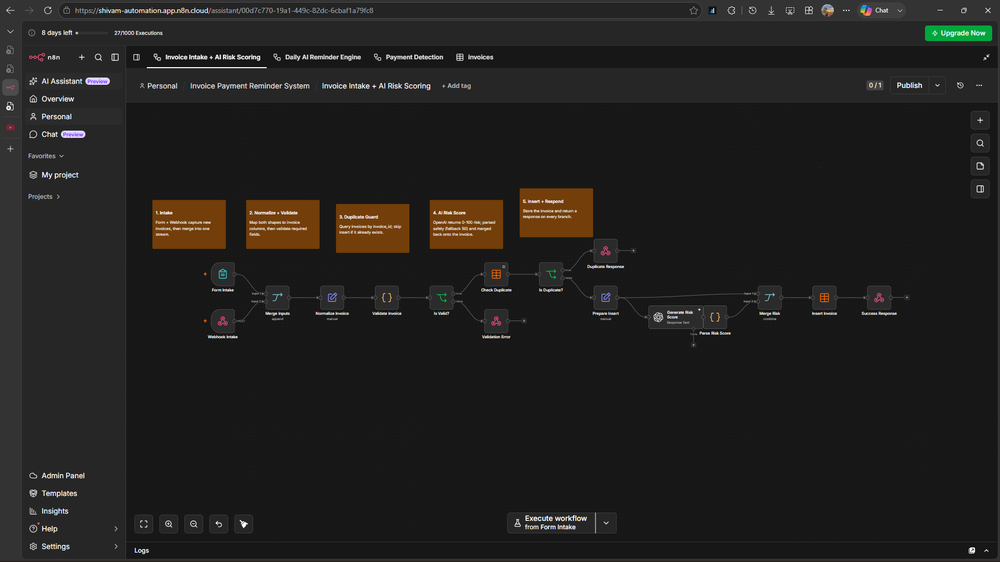
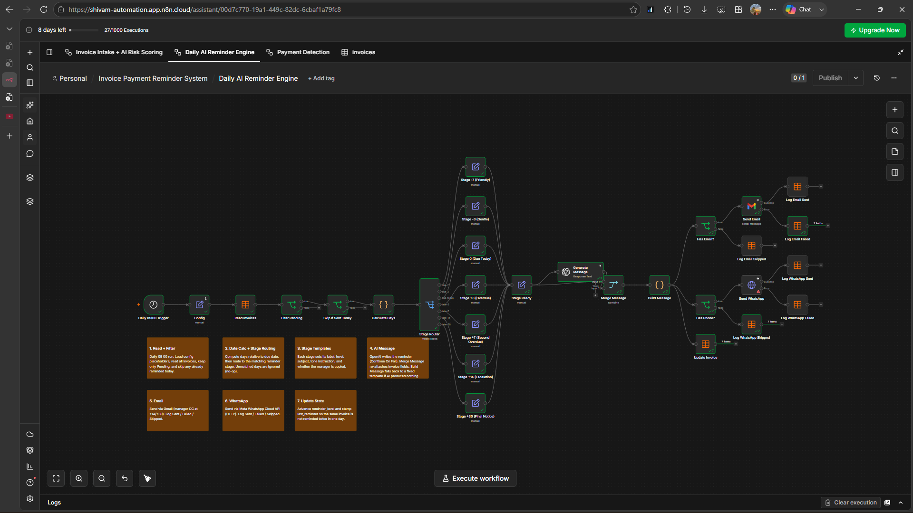
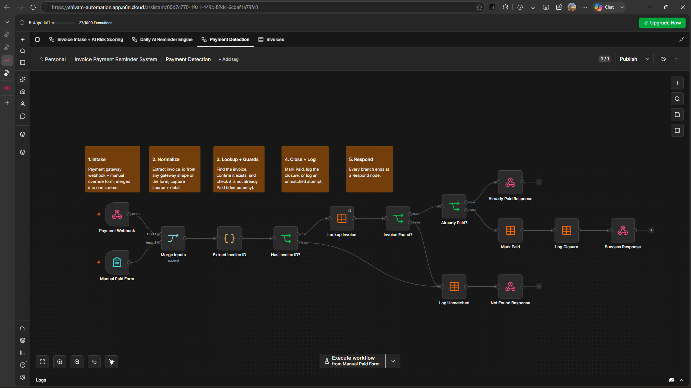
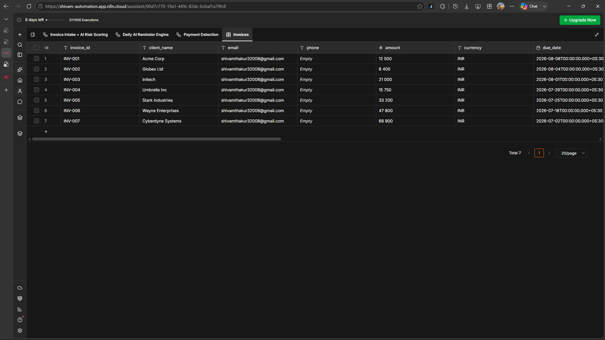

# 🚀 AI Invoice Collection Automation

> An AI-powered Accounts Receivable Automation System built with **n8n**, **OpenAI**, and API integrations to automate invoice tracking, payment reminders, and payment status management.

---

# 📌 Overview

Managing unpaid invoices manually is time-consuming and often leads to delayed payments.

This automation streamlines the entire invoice collection process by automatically:

- Capturing invoices
- Validating invoice data
- Calculating AI payment risk scores
- Sending scheduled payment reminders
- Tracking payment status
- Stopping reminders after payment

The project demonstrates how AI and workflow automation can reduce manual work while improving invoice management.

---

# ✨ Features

- ✅ Invoice Intake Automation
- 🤖 AI Payment Risk Scoring
- 📧 Automated Email Reminders
- 💬 WhatsApp Integration Ready
- 📅 Daily Scheduled Reminder Engine
- 🔍 Duplicate Invoice Detection
- 💳 Payment Detection Workflow
- 📊 Centralized Invoice Database
- 📝 Reminder Logging
- 🔗 API/Webhook Ready

---

# 🏗 System Architecture

```text
                New Invoice
                     │
                     ▼
     Invoice Intake + AI Risk Scoring
                     │
                     ▼
             Invoice Data Table
          ┌──────────┴──────────┐
          │                     │
          ▼                     ▼
 Daily AI Reminder Engine   Payment Detection
          │                     │
          ▼                     ▼
   Email / WhatsApp         Mark as Paid
          │                     │
          └──────────┬──────────┘
                     ▼
              Invoice Completed
```

---

# 🔄 Workflow Overview

## Workflow 1 – Invoice Intake + AI Risk Scoring

This workflow:

- Accepts invoices through Forms or Webhooks
- Validates invoice information
- Prevents duplicate invoices
- Generates an AI-based payment risk score
- Stores invoices in the centralized database

---

## Workflow 2 – Daily AI Reminder Engine

Runs every day automatically.

It:

- Reads pending invoices
- Calculates due dates
- Determines reminder stages
- Generates AI-powered reminder messages
- Sends Email reminders
- Supports WhatsApp integration
- Logs reminder history
- Updates invoice reminder status

---

## Workflow 3 – Payment Detection

Detects completed payments.

It:

- Receives payment events
- Searches invoices
- Updates payment status
- Stops future reminders
- Records payment activity

---

# 🖼 Workflow Screenshots

## Invoice Intake + AI Risk Scoring



---

## Daily AI Reminder Engine



---

## Payment Detection



---

## Invoice Data Table



---

# 🛠 Tech Stack

- n8n
- OpenAI
- Gmail
- HTTP API
- Webhooks
- JavaScript
- JSON
- Data Tables

---

# 📂 Repository Contents

```
README.md

Invoice Intake + AI Risk Scoring.json

Daily AI Reminder Engine.json

Payment Detection.json

Workflow_1.png

Workflow_2.png

Workflow_3.png

Dummy_data-table.png
```

---

# ⚙ Current Project Status

This is a portfolio demonstration project.

Current demo includes:

- Sample invoice records
- Working reminder engine
- AI risk scoring
- Email reminder workflow

The following integrations are prepared but require business credentials:

- WhatsApp Business Cloud API
- Stripe
- Razorpay
- Production CRM Integration

---

# 🚀 Future Improvements

- Stripe Integration
- Razorpay Integration
- Outlook Support
- Slack Notifications
- Analytics Dashboard
- Multi-company Support
- SMS Notifications

---

# 💼 Business Value

This solution helps businesses:

- Reduce manual invoice follow-ups
- Improve payment collection efficiency
- Minimize overdue invoices
- Maintain centralized invoice records
- Scale reminder operations automatically

---

# 👨‍💻 Skills Demonstrated

- Workflow Automation
- AI Integration
- Business Process Automation
- REST API Integration
- Webhook Handling
- Email Automation
- Data Validation
- Duplicate Detection
- Scheduled Automation
- Accounts Receivable Automation

---

# 📄 License

MIT License

---

⭐ If you found this project useful, consider giving it a star.
